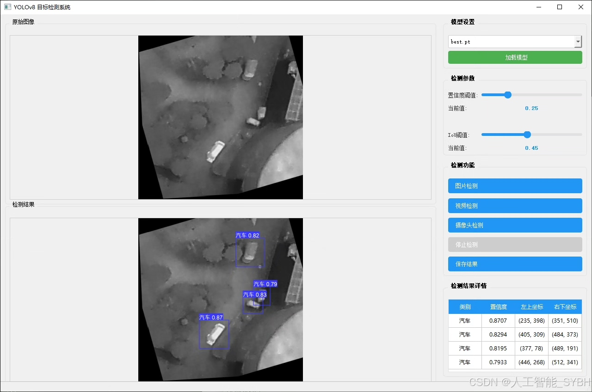
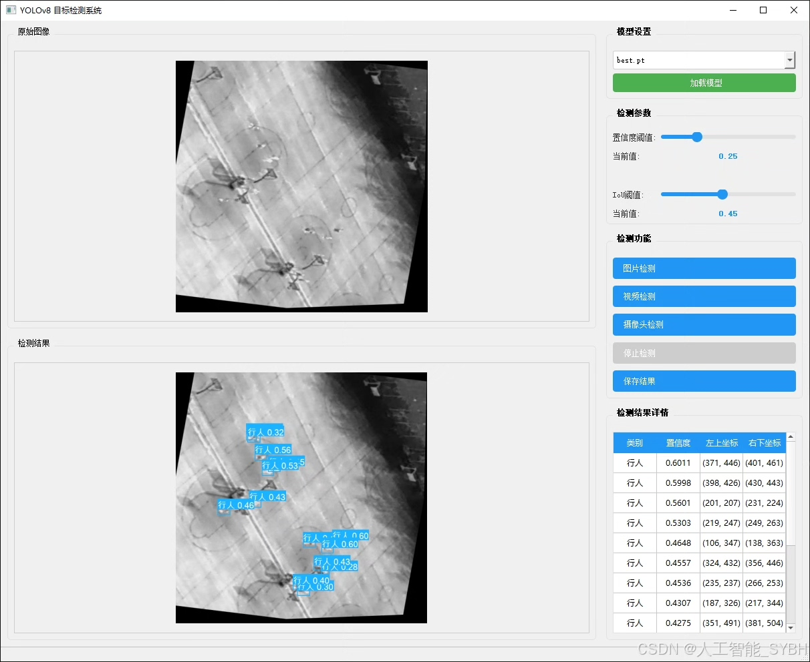
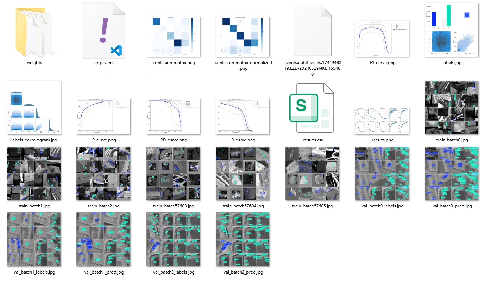
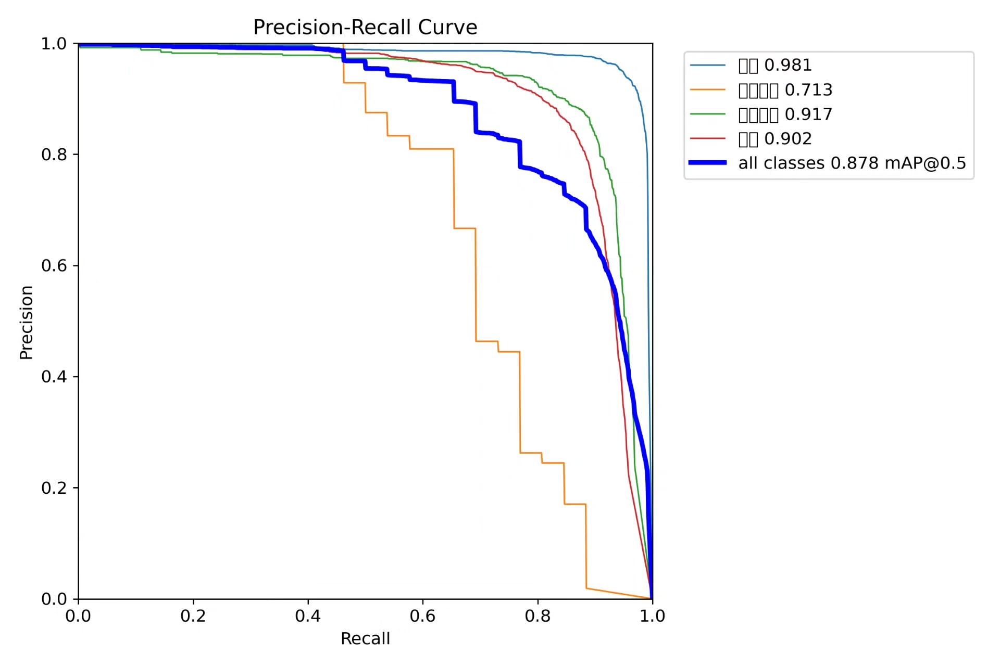
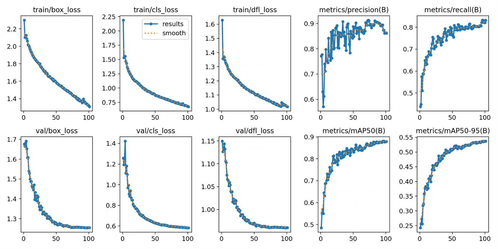
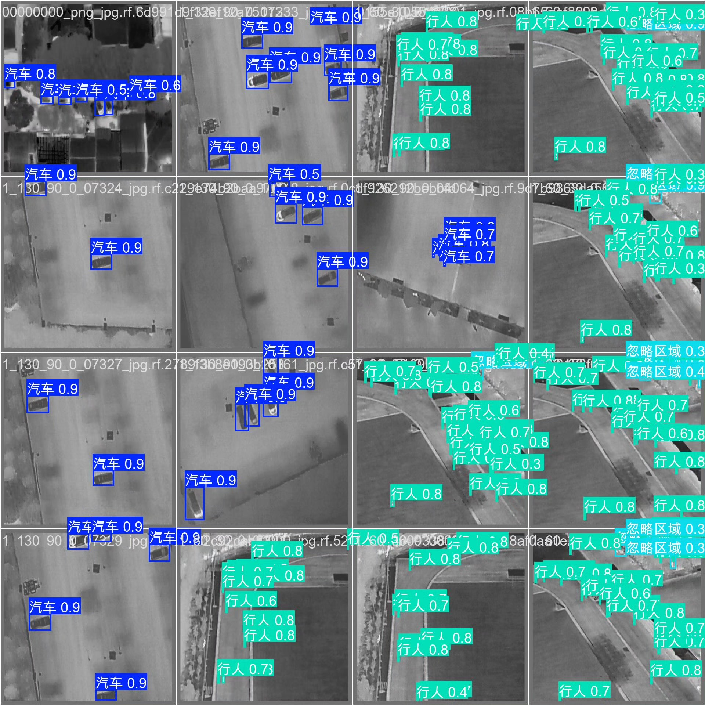
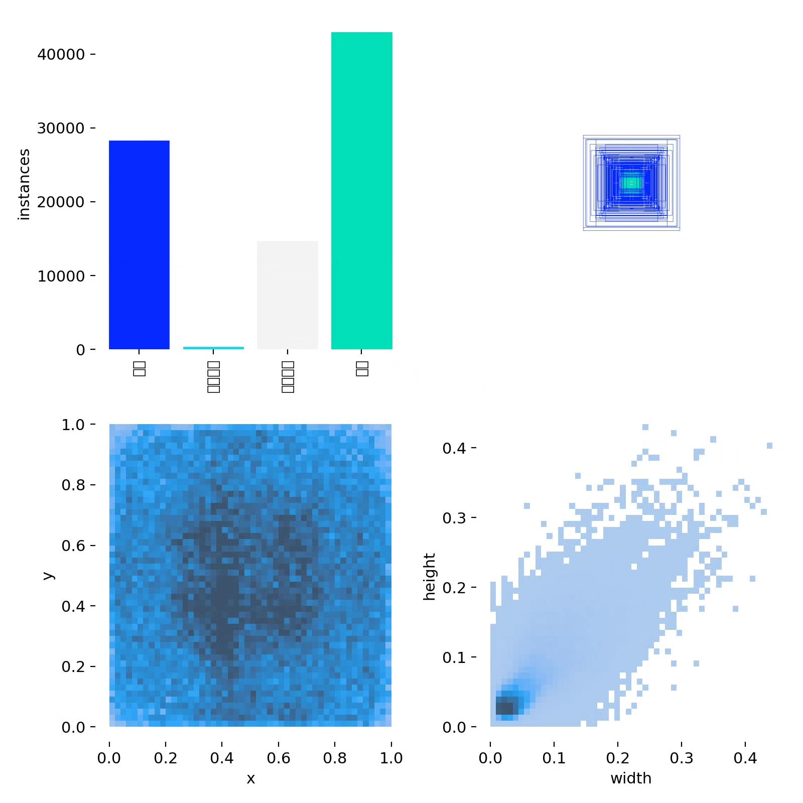
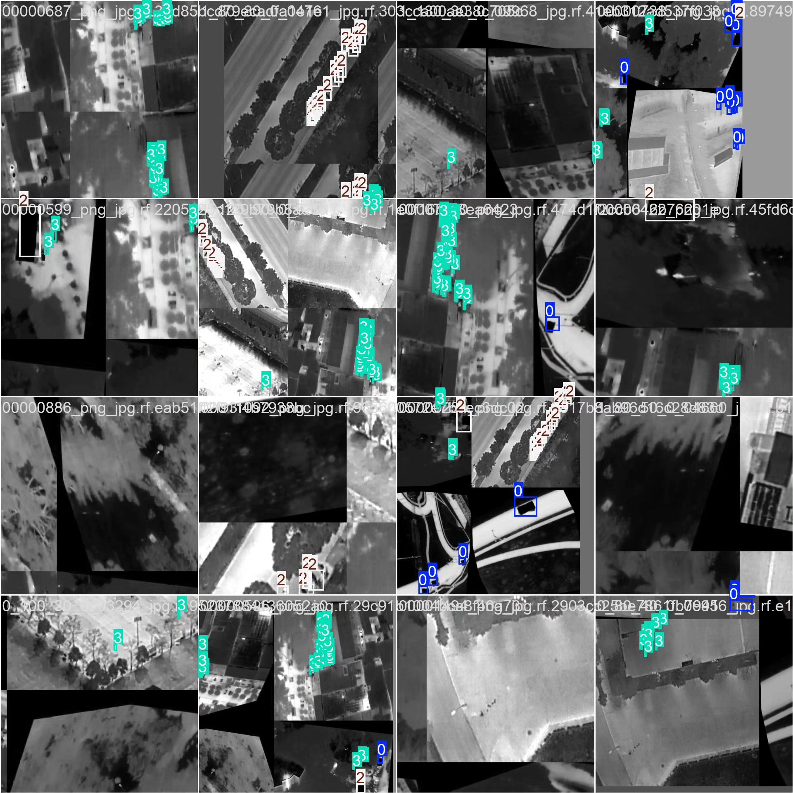

# Based on YOLOv8 deep learning for drone infrared detection system (vehicle and pedestrian)

## Body

This project is based on the YOLOv8 deep learning target detection algorithm, developing a real-time detection system for drone infrared images. It can accurately recognize four types of targets: vehicles (Car), other vehicles (OtherVehicle), pedestrians (Person), and invalid detection areas (DontCare). The system uses a large-scale infrared dataset for training, with 10,128 training images, 715 validation images, and 355 test images, ensuring the robustness and generalization ability of the model in complex environments.

The company's products have obtained the official commercial license certification from YOLO.

We provide after-sales service.

After payment, we will provide WeChat IDs to answer questions anytime.

Environment configuration: We will provide an environment configuration tutorial, and WeChat will provide answers.

Remote installation services: If you need remote configuration, an additional fee of 69 is required,

If the configuration fails, all fees will be refunded (specially for old computers only refund installation fees)

Retraining dataset: After setting up the environment, you can train on your own computer.
If you need us to retrain, just pay 69 + computing power fees (2.5 yuan/hour)

Full after-sales service

## Images

## Payment

Here is a pay link on Stripe ( https://buy.stripe.com/3cs8yP7sY87d0vu9AB ). Please contact me lonlonago@foxmail.com after funding $89, and I will send you a complete data files , thank you!

